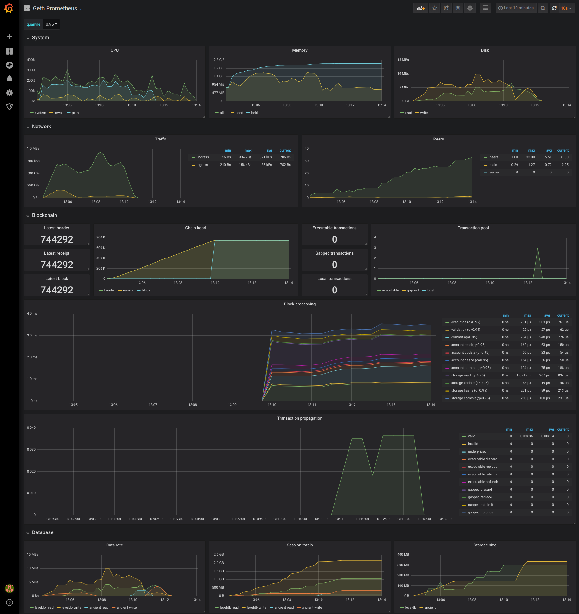

# Geth prometheus metrics

Collect and visualize [Geth](https://github.com/ethereum/go-ethereum) metrics with Prometheus and Grafana.

## Demo

```bash
docker-compose up -d
```

Kill all running images

```sh
sudo docker kill $(sudo docker ps -q)
```

Runs Geth on the Mordor testnet, Prometheus for data storage and Grafana for visualizing.

Open [localhost:3000](http://localhost:3000) (admin:admin) to explore the Grafana metrics dashboard.

## Dashboard



## Snapshot

A live test [snapshot](https://snapshot.raintank.io/dashboard/snapshot/fdZDK5EBa65M5x6ZkvnpdJXS1BqIZGb7) is also available from Raintank.
